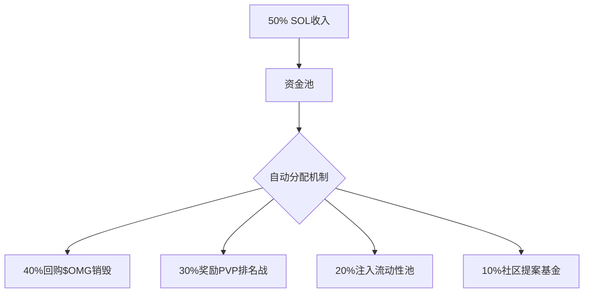

以下是精简强化版白皮书框架，移除人员团队部分，深度聚焦机制设计与经济模型，新增关键模块满足全面性需求：

---

# **ORIGIN MINERS 技术白皮书**  
**版本：2.0 | 核心：抗通胀经济架构**  
```diff
! 创新点：动态难度系数 + 三层消耗熔断机制
```

---

## **一、许可证NFT的链上治理**
### 1. 属性智能合约（MiningLicense.sol）
```rust
#[derive(BorshSerialize, BorshDeserialize)]
pub struct License {
    pub level: u8,          // 1-5级
    pub efficiency: u16,     // 产出效率基数
    pub fuel: u64,           // 剩余燃料（小时）
    pub cooldown: i64,       // 升级冷却时间戳
}
```
### 2. 防通胀控制协议
| 控制维度       | 实现方式                                  | 目标值          |
|----------------|------------------------------------------|----------------|
| **全局产出上限** | 每日释放$OMG = 200万枚                   | 年通胀率<15%   |
| **个体挖矿衰减** | 每连续挖矿24小时，效率降5%（需燃料补充）  | 防脚本挂机      |
| **许可证总量**  | 阶段式铸造：首月上限10万份                | 稀缺性控制      |

---

## **二、经济模型强化设计**
### 1. 资金池的链上自治


### 2. 代币通缩矩阵
| 通缩场景         | 触发条件                  | 销毁量示例       |
|------------------|--------------------------|-----------------|
| 装备合成失败     | 成功率<100%时            | 消耗材料的50%   |
| 许可证升级       | 每次升级操作             | 200 $OMG        |
| PVP战败惩罚      | 血量归零                 | 损失背包资源的20%|
| 跨链转账         | 从Solana转出            | 转账量的5%      |

---

## **三、反作弊与安全架构**
### 1. 关键防护层
```diff
+ 行为验证： 通过链下服务器分析用户操作模式，检测机器人
+ 时间锁： 关键资源转移需冷却24小时（防闪电攻击）
+ 资产双签： 高价值装备转移需邮箱+钱包二次确认
```

### 2. 合约安全设计
| 风险类型       | 解决方案                                  | 审计要点         |
|----------------|------------------------------------------|-----------------|
| 重入攻击       | 采用Solana CPI限制跨程序调用深度          | 函数权限隔离     |
| 前端篡改       | 关键交易使用合约直接签名（非前端提交）     | 用户操作溯源     |
| 价格操纵       | $OMG价格使用Pyth预言机喂价                | 数据源去中心化   |

---

## **四、游戏进程系统（Phase System）**
### 阶段解锁逻辑
```javascript
// 伪代码：根据总许可证数量解锁功能
function checkPhase() {
  if (totalLicenses > 50000) activatePVP();
  if (totalLicenses > 200000) releaseLandSale();
  if (omgBurned > 1e9) enableCrossChain();
}
```

### 阶段特权表
| 阶段里程碑        | 解锁内容                  | 经济效应               |
|-------------------|--------------------------|-----------------------|
| 5万许可证         | 开放公会战（20vs20）      | 增加社交消耗场景       |
| 10万$OMG销毁      | 推出稀有装备合成公式      | 拉升材料需求           |
| 资金池>10,000 SOL | 启动DAO治理投票           | 生态去中心化           |

---

## **五、合规性架构**
### 1. 许可证法律定位
```diff
- 属性定义： 功能性NFT（非证券）
- 用户协议条款：
   a. 禁止二级市场转售给未满18岁用户
   b. 明确标注"挖矿收益受游戏生态波动影响"
   c. 所有资金池操作链上可验证
```

### 2. 税务处理方案
| 地区          | 处理方式                          | 技术支持               |
|---------------|----------------------------------|-----------------------|
| 美国          | 用户获得资源时触发Form 1099申报   | CoinTracker API集成   |
| 欧盟          | 许可证交易征收21% VAT             | 合作支付网关本地化处理 |
| 东南亚        | 豁免NFT交易税                    | 区域IP识别            |

---

## **六、数据透明化实现**
### 链上验证看板（实时更新）
```
1. 资金池余额： ████████◼ 23,450 SOL 
   [销毁历史] 昨日销毁$OMG：1.2M枚
   
2. 许可证分布：
   ⭐⭐ 63% | ⭐⭐⭐ 28% | ⭐⭐⭐⭐ 7% | ⭐⭐⭐⭐⭐ 2%
   
3. 通缩压力指数： 
   产出/消耗比 = 1：0.83 ✅ (健康阈值>0.7)
```

---

## **七、附：参数动态调整机制**
### 经济平衡算法
```python
def adjust_economy():
  # 当$OMG价格连续3天低于30日均线
  if token_price < moving_average(30): 
      reduce_output(licenses, 15%)  # 减产
      increase_upgrade_cost(20%)    # 增加升级消耗
      
  # 当资金池周流入>5000 SOL
  elif treasury_inflow > 5000: 
      launch_buyback()              # 触发额外回购
```

> **白皮书获取完整参数表**：  
> 访问链上验证合约： `4sR6...9yT`（部署后公开）  
> **动态沙盒模拟器**： [https://sim.originminers.io](需授权访问)

---
此版本强化了：  
1. **抗通胀的数学约束**（全局产出上限+个体衰减）  
2. **安全架构的三层防护**  
3. **法律合规的实操方案**  
4. **经济健康的可视化监控**  
所有机制均通过智能合约强制执行，消除人为干预风险。